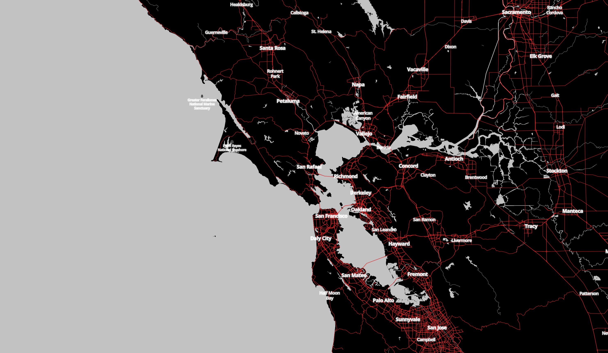
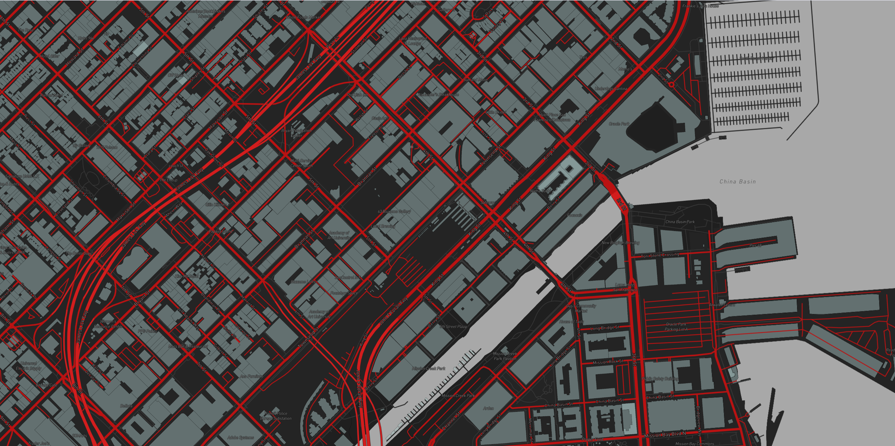

# STARSOF THELID MAP

<<<<<<< HEAD
Images of the map with red veins and soft blue buildings

     
=======
     
>>>>>>> 4365b1b3a1f8e91af133cc63e263d6ce3aa7a98a

### How to run

    git clone https://github.com/xerk-dot/starsof.git

    npm install
    npm start

    open http://localhost:3000/

### Access token

    mapboxgl.accessToken = // YOUR_API_KEY_HERE

Replace the [API key](https://docs.mapbox.com/help/getting-started/access-tokens/) in `src/Map.js`.

Runs the app from http://localhost:3000
